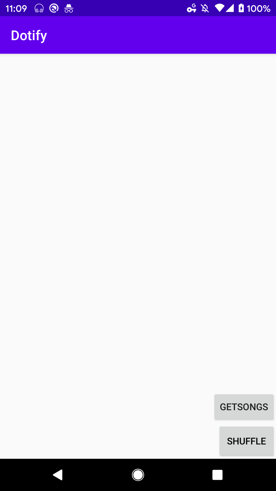

# Liam Albright Homework 4 **Dotify**
Same thing as HW 3 but with a http call to get the song data. 

Description: This is an application that does a music player UI mockup in Android. First, the application loads a playlist of songs where a user can click on the song and have a mini-player at the bottom of the screen update with the song that was clicked. Then if the user clicks the mini-player the app goes to a mock-up music player screen that has a back button in the top header which takes the user back to the playlist page. on the playlist page, there is also a shuffle button that allows the user to shuffle the playlist.  the music player screen also allows you to change your user name and interact with a back, play, and forward button.

## **App screenshot1**

## **App screenshot2**

